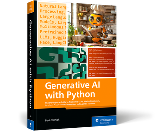

# Introduction

This repository contains the code for the book "Generative AI with Python".



# Table of Contents

- [Introduction](#introduction)
- [Table of Contents](#table-of-contents)
- [Installation](#installation)
  - [Default Installation](#default-installation)
  - [Alternative Installation](#alternative-installation)
- [Folder structure](#folder-structure)
- [Contact](#contact)


# Installation

## Default Installation

1. Clone the repository

2. Install uv 

On your command line, run:

```bash
pip install uv
```

3. Sync the dependencies

On your command line, run:

```bash
uv sync
```

## Alternative Installation

If you run into issues with uv, you can also install the dependencies manually. Just open the `pyproject.toml` file and install the dependencies listed there.

For example, to install langchain, run:

```bash
pip install langchain
```

# Folder structure

```bash
├───02_PreTrainedNetworks
├───03_LLMs
├───04_PromptEngineering
├───05_VectorDatabases
├───06_RAG
├───07_AgenticSystems
├───08_Deployment
```

# Contact

If you have any questions, issues or feedback, please contact me via email at [info@gollnickdata.de](mailto:info@gollnickdata.de).


